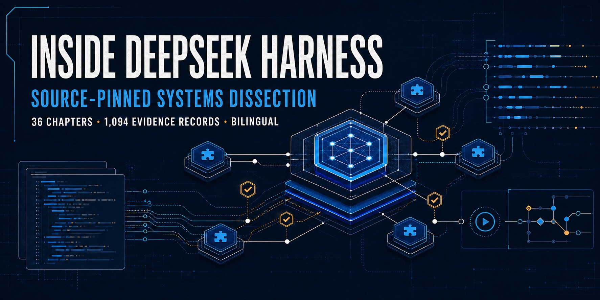
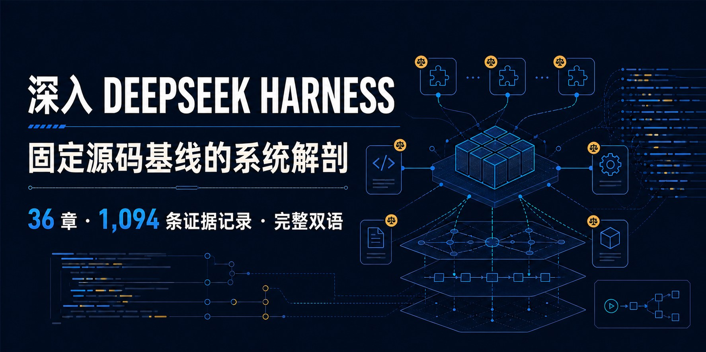

# Inside DeepSeek Harness

[English (default)](#english) · [中文](#中文)

<a id="english"></a>

## English

### A source-pinned systems dissection of a plugin-first coding-agent runtime



DeepSeek Harness is more than a coding-agent interface. This independent study reconstructs how its plugin graph, Agent loop, session log, tool pipeline, permissions, sandboxing, replay, and multi-Agent orchestration actually work—starting from real entry points, state mutations, failure branches, and persistence boundaries.

| Verified chapters | Evidence records | Catalog paths | Upstream packages mapped |
|---:|---:|---:|---:|
| **36/36** | **1,094** | **533** | **219** |

**[Read the interactive report →](https://hoco-scy.github.io/deepseek-harness-deep-dive/)**

[中文版本](https://hoco-scy.github.io/deepseek-harness-deep-dive/zh/) · [Single-file Markdown](./DEEPSEEK-HARNESS-ANALYSIS.md) · [Evidence catalog](https://hoco-scy.github.io/deepseek-harness-deep-dive/pages/glossary-evidence.html) · [Pinned upstream source](https://github.com/deepseek-ai/deepseek-harness/tree/47f943859bef60e4160492346772ded9b24f765a)

> Independent research, not an official DeepSeek publication. Every factual claim is pinned to upstream commit [`47f943859bef60e4160492346772ded9b24f765a`](https://github.com/deepseek-ai/deepseek-harness/tree/47f943859bef60e4160492346772ded9b24f765a).

### Five findings worth starting with

- **Replay is not one feature.** DeepSeek Harness defines separate reconstruction contracts for model state, requests, streams, crashes, clients, and forks. [Read the replay analysis →](https://hoco-scy.github.io/deepseek-harness-deep-dive/pages/log-replay.html)
- **Parallel completion does not mean out-of-order truth.** Tools may finish out of order, while policy processing and durable results still commit in the model's original order. [Read the parallelism analysis →](https://hoco-scy.github.io/deepseek-harness-deep-dive/pages/tool-parallelism.html)
- **Durable history is not autonomous memory.** The runtime supports explicit cross-session recall, but ships no autonomous long-term memory loop by default. [Read the memory analysis →](https://hoco-scy.github.io/deepseek-harness-deep-dive/pages/memory-knowledge.html)
- **Code Mode is not a permission escape hatch.** Every nested tool call re-enters the approval, guard, sandbox, and result pipeline. [Read the Code Mode analysis →](https://hoco-scy.github.io/deepseek-harness-deep-dive/pages/code-mode-self-modification.html)
- **Crash recovery refuses to invent success.** It deterministically closes unknown state without claiming that an external side effect completed. [Read the recovery analysis →](https://hoco-scy.github.io/deepseek-harness-deep-dive/pages/failure-recovery.html)

### Choose a reading path

- **Core runtime:** [Design philosophy](https://hoco-scy.github.io/deepseek-harness-deep-dive/pages/design-philosophy.html) → [Turn / Step / Loop](https://hoco-scy.github.io/deepseek-harness-deep-dive/pages/turn-step-loop.html) → [Prompt assembly](https://hoco-scy.github.io/deepseek-harness-deep-dive/pages/prompt-context.html) → [Session events](https://hoco-scy.github.io/deepseek-harness-deep-dive/pages/session-event-model.html)
- **Durability:** [Persistence](https://hoco-scy.github.io/deepseek-harness-deep-dive/pages/persistence-database.html) → [Projections and checkpoints](https://hoco-scy.github.io/deepseek-harness-deep-dive/pages/projections-checkpoints.html) → [Compaction](https://hoco-scy.github.io/deepseek-harness-deep-dive/pages/compaction.html) → [Replay and forking](https://hoco-scy.github.io/deepseek-harness-deep-dive/pages/log-replay.html)
- **Execution governance:** [Tool primitives](https://hoco-scy.github.io/deepseek-harness-deep-dive/pages/tool-primitives.html) → [Permissions and approval](https://hoco-scy.github.io/deepseek-harness-deep-dive/pages/permission-approval.html) → [Sandbox and filesystem](https://hoco-scy.github.io/deepseek-harness-deep-dive/pages/sandbox-filesystem.html) → [Security boundaries](https://hoco-scy.github.io/deepseek-harness-deep-dive/pages/security-trust.html)
- **Orchestration:** [Multi-Agent](https://hoco-scy.github.io/deepseek-harness-deep-dive/pages/multi-agent.html) → [Workflow and Ralph](https://hoco-scy.github.io/deepseek-harness-deep-dive/pages/workflow-ralph.html) → [Inbox and continuation](https://hoco-scy.github.io/deepseek-harness-deep-dive/pages/inbox-steering-continuation.html) → [Failure recovery](https://hoco-scy.github.io/deepseek-harness-deep-dive/pages/failure-recovery.html)

### What the report covers

The 36 chapters span design philosophy, Cordis composition, boot profiles, the Agent lifecycle, prompt and context assembly, LLM adapters, session events, persistence, projections, compaction, memory, plans and goals, the complete tool system, permissions, sandboxes, shell and terminal execution, Skill/MCP/LSP/Web capabilities, Code Mode, multi-Agent coordination, workflows, failure recovery, observability, API/SDK/ACP, the Web UI, security, tests, and design tradeoffs.

Every chapter distinguishes three kinds of claims:

- **Source fact:** directly demonstrated by code, configuration, tests, or official documentation at the pinned commit.
- **Mechanism-level deduction:** a control-flow or semantic conclusion assembled from multiple source facts.
- **Design assessment:** the author's judgment about tradeoffs, strengths, costs, and operating boundaries.

The coverage numbers are deterministic navigation metrics over the published evidence catalog. They do not claim complete symbol coverage, architectural completeness, or proof quality.

### Local preview

```bash
npm run build
npm run check
python3 -m http.server 8080 --directory docs
```

Strict source-range validation uses a sibling `../deepseek-harness` checkout by default. For another location, run `node scripts/build-markdown.mjs --check --source-check required --upstream-root PATH`.

Open `http://127.0.0.1:8080/` for English or `http://127.0.0.1:8080/zh/` for Chinese. The site is fully static. “My Learning Notes” is saved only to this browser's `localStorage`; it is never committed or sent to a server.

### Status and boundary

All 36 chapters are marked `Verified` at the pinned baseline. Future upstream changes require a new pinned snapshot; they never silently rewrite this report's factual baseline.

This repository contains only an independent analysis of publicly available DeepSeek Harness source. It contains no private implementation details or private architectural conclusions from any other project.

### Licensing

Research content and visual assets are licensed under [CC BY 4.0](./LICENSE). Software and build tooling are licensed under the [MIT License](./LICENSE-CODE). See the bilingual [licensing scope](./LICENSING.md) for the exact file boundaries and third-party exclusions.

---

<a id="中文"></a>

## 中文

### 深入 DeepSeek Harness：一份固定源码基线、逐条可追溯的 Coding Agent 系统解剖



DeepSeek Harness 不只是一套 coding-agent 界面。这份独立研究从真实入口、状态变化、失败分支与持久化落点出发，复原其插件图、Agent 循环、Session 日志、工具管线、权限、沙箱、重放和多 Agent 编排究竟如何工作。

| 已复核章节 | 证据记录 | 证据目录路径 | 已盘点上游包 |
|---:|---:|---:|---:|
| **36/36** | **1,094** | **533** | **219** |

**[阅读交互式中文版 →](https://hoco-scy.github.io/deepseek-harness-deep-dive/zh/)**

[English（默认）](https://hoco-scy.github.io/deepseek-harness-deep-dive/) · [单篇中文 Markdown](./DEEPSEEK-HARNESS-ANALYSIS.zh-CN.md) · [证据目录](https://hoco-scy.github.io/deepseek-harness-deep-dive/zh/pages/glossary-evidence.html) · [固定上游源码](https://github.com/deepseek-ai/deepseek-harness/tree/47f943859bef60e4160492346772ded9b24f765a)

> 本仓库是独立研究，并非 DeepSeek 官方发布。所有事实结论均固定到上游 commit [`47f943859bef60e4160492346772ded9b24f765a`](https://github.com/deepseek-ai/deepseek-harness/tree/47f943859bef60e4160492346772ded9b24f765a)。

### 建议先读的五个结论

- **“重放”不是一种功能。** DeepSeek Harness 为模型状态、请求、流、崩溃、客户端与分叉分别定义了不同的重建契约。[阅读重放分析 →](https://hoco-scy.github.io/deepseek-harness-deep-dive/zh/pages/log-replay.html)
- **并行完成不等于事实乱序。** 工具可以乱序结束，但策略处理与持久结果仍按模型原始顺序提交。[阅读并行分析 →](https://hoco-scy.github.io/deepseek-harness-deep-dive/zh/pages/tool-parallelism.html)
- **持久历史不等于自主记忆。** 运行时支持显式跨会话召回，但默认并未提供自主运行的长期记忆循环。[阅读记忆分析 →](https://hoco-scy.github.io/deepseek-harness-deep-dive/zh/pages/memory-knowledge.html)
- **Code Mode 不是权限逃逸通道。** 每个嵌套工具调用仍会重新进入审批、Guard、沙箱与结果流水线。[阅读 Code Mode 分析 →](https://hoco-scy.github.io/deepseek-harness-deep-dive/zh/pages/code-mode-self-modification.html)
- **崩溃恢复拒绝制造成功。** 它会确定性闭合未知状态，但不会声称外部副作用已经完成。[阅读恢复分析 →](https://hoco-scy.github.io/deepseek-harness-deep-dive/zh/pages/failure-recovery.html)

### 选择阅读路径

- **核心运行时：**[设计哲学](https://hoco-scy.github.io/deepseek-harness-deep-dive/zh/pages/design-philosophy.html) → [Turn / Step / Loop](https://hoco-scy.github.io/deepseek-harness-deep-dive/zh/pages/turn-step-loop.html) → [提示词组装](https://hoco-scy.github.io/deepseek-harness-deep-dive/zh/pages/prompt-context.html) → [Session 事件](https://hoco-scy.github.io/deepseek-harness-deep-dive/zh/pages/session-event-model.html)
- **持久化：**[数据库与持久化](https://hoco-scy.github.io/deepseek-harness-deep-dive/zh/pages/persistence-database.html) → [Projection 与 Checkpoint](https://hoco-scy.github.io/deepseek-harness-deep-dive/zh/pages/projections-checkpoints.html) → [压缩](https://hoco-scy.github.io/deepseek-harness-deep-dive/zh/pages/compaction.html) → [重放与 Fork](https://hoco-scy.github.io/deepseek-harness-deep-dive/zh/pages/log-replay.html)
- **执行治理：**[工具原语](https://hoco-scy.github.io/deepseek-harness-deep-dive/zh/pages/tool-primitives.html) → [权限与审批](https://hoco-scy.github.io/deepseek-harness-deep-dive/zh/pages/permission-approval.html) → [沙箱与文件系统](https://hoco-scy.github.io/deepseek-harness-deep-dive/zh/pages/sandbox-filesystem.html) → [安全边界](https://hoco-scy.github.io/deepseek-harness-deep-dive/zh/pages/security-trust.html)
- **编排：**[多 Agent](https://hoco-scy.github.io/deepseek-harness-deep-dive/zh/pages/multi-agent.html) → [Workflow 与 Ralph](https://hoco-scy.github.io/deepseek-harness-deep-dive/zh/pages/workflow-ralph.html) → [Inbox 与 Continuation](https://hoco-scy.github.io/deepseek-harness-deep-dive/zh/pages/inbox-steering-continuation.html) → [故障恢复](https://hoco-scy.github.io/deepseek-harness-deep-dive/zh/pages/failure-recovery.html)

### 报告覆盖范围

36 章覆盖设计哲学、Cordis 组合、启动 Profile、Agent 生命周期、提示词与上下文组装、LLM Adapter、Session 事件、持久化、Projection、压缩、记忆、Plan 与 Goal、完整工具系统、权限、沙箱、Shell 与 Terminal、Skill/MCP/LSP/Web、Code Mode、多 Agent、Workflow、故障恢复、可观测、API/SDK/ACP、Web UI、安全、测试与设计取舍。

每篇正文严格区分三类结论：

- **源码事实：**可由固定 commit 下的代码、配置、测试或官方文档直接证明。
- **机制推导：**由多处事实串成的控制流或语义结论。
- **设计评价：**作者对取舍、优势、代价和适用边界的判断。

覆盖数字是对已发布证据目录的确定性导航指标，不代表完整的符号覆盖、架构完整性或证明质量。

### 本地查看

```bash
npm run build
npm run check
python3 -m http.server 8080 --directory docs
```

严格源码行号验证默认读取同级 `../deepseek-harness` checkout；如位于其他目录，运行 `node scripts/build-markdown.mjs --check --source-check required --upstream-root PATH`。

英文版打开 `http://127.0.0.1:8080/`，中文版打开 `http://127.0.0.1:8080/zh/`。站点是纯静态文件；每页的“我的学习体会”只保存在当前浏览器的 `localStorage`，不会提交到仓库或发送到服务器。

### 状态与边界

固定基线下的 36 章全部标记为`已复核`。后续上游变化需要建立新的固定快照，不会静默改写本报告中的事实基线。

本仓库只包含基于公开源码的 DeepSeek Harness 独立拆解，不包含任何其他项目的非公开实现或内部架构结论。

### 许可证

研究内容与视觉资产采用 [CC BY 4.0](./LICENSE)，软件与构建工具采用 [MIT License](./LICENSE-CODE)。准确的文件适用范围与第三方材料排除项请见双语[许可说明](./LICENSING.md)。
